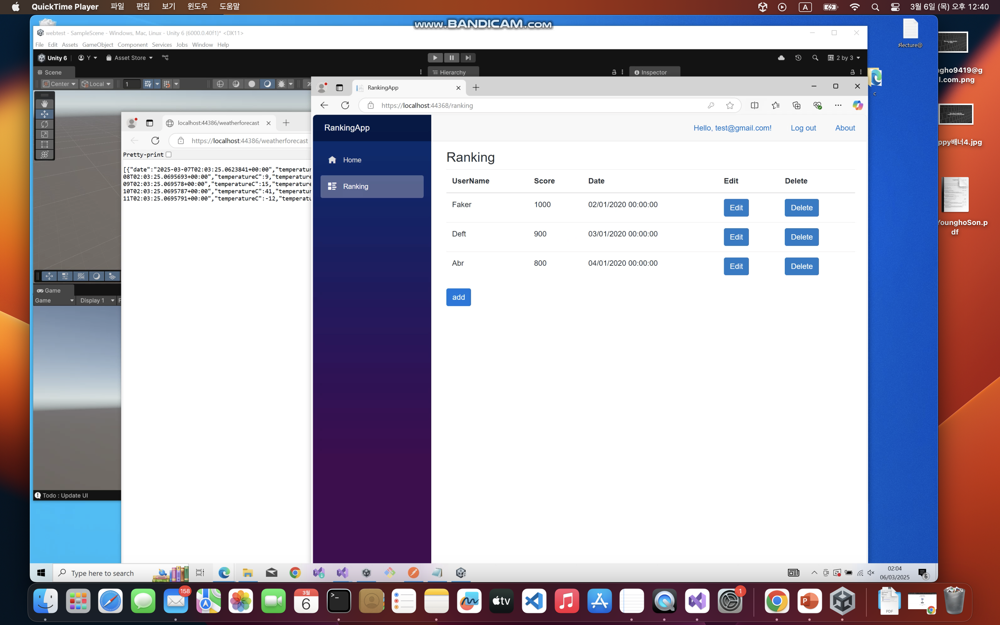
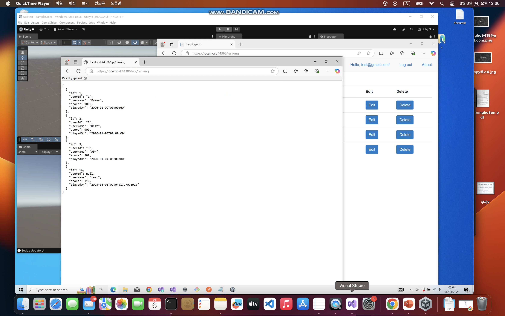
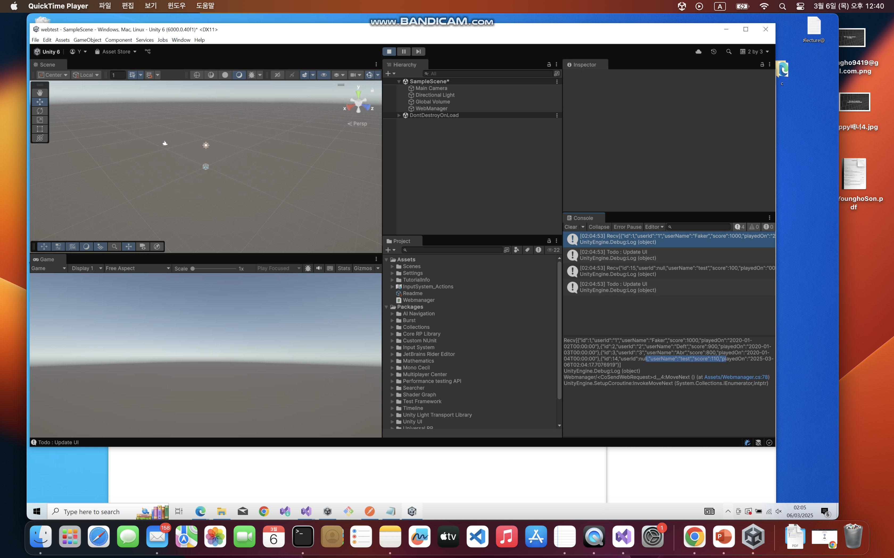
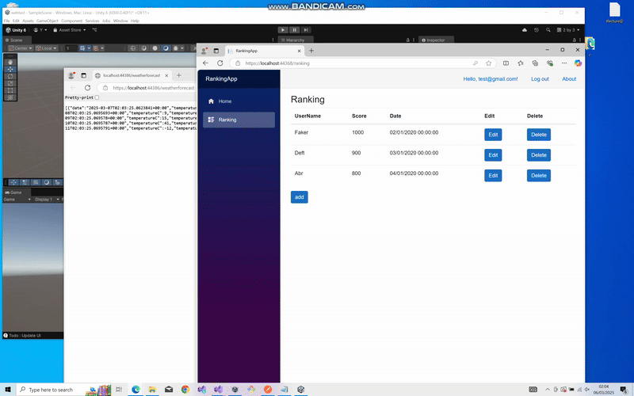

# Ranking App integrated with Blazor + WebApi + Unity 


<div style="display: flex; justify-content: space-around;">
  
  
  
</div>


---
---
<br>


# Overview
A Blazor Server application integrated with Unity, featuring real-time score and ranking management via WebAPI and JSON communication. The Blazor Server application provides a score and ranking system, allowing users to view, modify, and delete scores. A .NET WebAPI backend handles JSON-based communication between Blazor and Unity by using shared Entity Framework Core database. The Unity integrates with the API to communicate game data.


---
---
<br>


# Feature


1. Blazor Server Application: 
  - Interactive web UI to manage scores and rankings. 
<br>

2. WebAPI (RESTful API):
  - Handles score retrieval, updates, and deletions.  
<br>
  
3. Unity Integration:
  - Embeds Unity games and syncs data via API.  
<br>

4. JSON-based Communication:
  - Enables smooth data exchange between Unity & WebApi.
<br>

5. Real-Time Score & Ranking Management:
  - View and modify leaderboard data via Blazor server.
<br>

6. Authentication & Authorization :
  - Secure API access with user authentication.  


---
---
<br>

# Core technologies

- **Blazor Server** - .NET-based interactive web app framework.
<br>

- **ASP.NET WebAPI** - RESTful API backend for JSON communication. 
<br>

- **Unity Networking** - Uses UnityWebRequest for GameObjects.
<br>

- **Entity Framework Core (EF Core)** - Database management for scores & rankings.
<br>


---
---
<br>


# Project structure

```graphql
BlazorAppWithUnity/ 
│── RankingApp/ # Blazor Server, WebApi 
│ ├── .vs/ 
│ ├── RankingApp/ 
│ ├── SharedData/ # Entity Framework core
│ ├── WebAPI/ # ASP.NET WebAPI for score & ranking 
│ ├── test/
│ ├── RankingApp.sln/
│ ├── RankingApp.slnLaunch.user
│── webtest/ # Unity game project 
│ ├── .vs/ 
│ ├── Assets/ 
│ │ ├── Scenes/ 
│ │ ├── Setting/
│ │ ├── TutorialInfo/
│ │ │ ├── InputSystem_...   
│ │ │ ├── ...
│ │ │ ├── ...
│ │ │ ├── Webmanager.cs # Unity script for web request
│ │ │ ├── Webmanager.cs.meta
│ ├── Logs/ 
│ ├── Packages/ 
│ ├── ProjectSettings/ 
│ ├── ...
│ ├── ...
│── 
│── README.md 
│── .gitignore 


```

---
---
<br>

# Deployment

## 1. Installation

```bash
git clone https://github.com/sudoyh/BlazorAppWithUnity.git

cd BlazorAppWithUnity

```

<br>

## 2. Open in Visual Studio


- Open Solution Explorer   
- Right-click on the Solution 
- Click "Set Startup Projects"
- Choose "Multiple startup projects"
- Set 'RankingApp' and 'WebAPi' project to "Start"
- Start sever

## 3. Run the unity

- Click ▶ Play in the Unity Editor


# Full video link 

Youtube : 


[📺 Youtube Link : https://youtu.be/C8KkvkgaZR4 ](https://youtu.be/C8KkvkgaZR4)

---
---
<br>

# Demo




